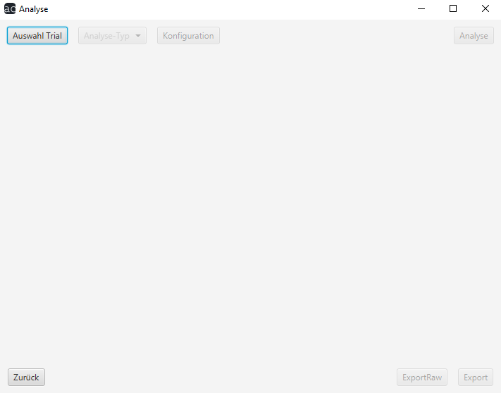
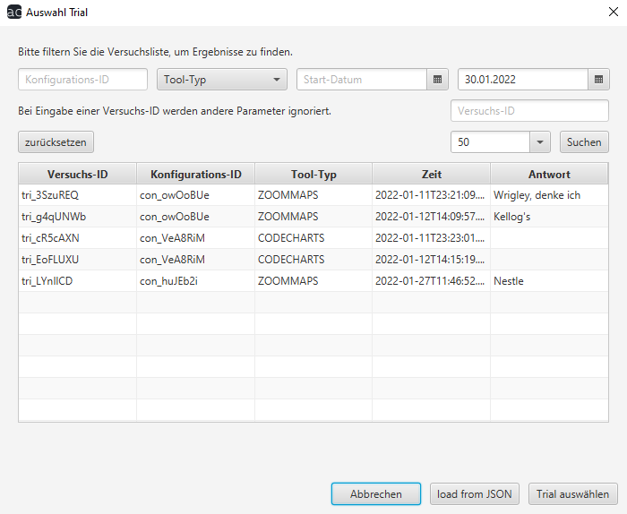
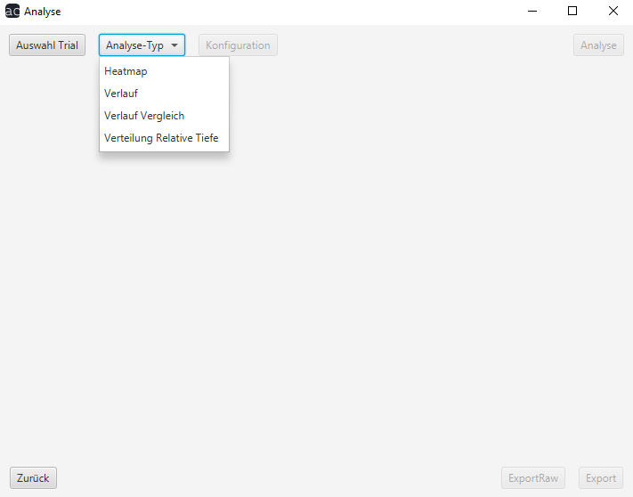

# Analyse Benutzerhandbuch

## Analyse

Bei der Analyse können Sie einen oder mehrere durchgeführte Versuche genauer betrachten oder analysieren.
Um dies zu tun, müssen Sie auf den "Auswahl Trial"-Button gehen und ihn anklicken.

Daraufhin geht ein neues Fenster auf, in welchem Ihnen die zur Verfügung stehenden Versuche angezeigt werden.

Am oberen Rand des Bildschirms werden Ihnen verschiedene Möglichkeiten gegeben um die Versuche zu Filtern.
- ##### Konfigurations-ID
  Hier können Sie nach einer bestimmten Konfigurations-ID suchen um somit vergleichbare Versuche auswerten zu können
- ##### Tool-Typ
  Hier können Sie die Versuche nach den unterschiedlichen Versuchsarten (Codecharts, Eyetracking, Zoommaps) filtern
- ##### Start- und End-Datum
  Falls Sie nur Versuche aus einem bestimmten Zeitraum analysieren wollen, können Sie hier diesen Zeitraum bestimmen. Das Enddatum ist automatisch auf den aktuellen Tag voreingestellt, kann aber von Ihnen verändert werden
- ##### Versuchs-ID
  Falls Sie die Versuche eines spezifischen Testobjekts suchen, können Sie hier die entsprechende Versuchs-ID angeben. WICHTIG: Falls Sie nach einer Versuchs-ID suchen, werden alle weiteren eingegebenen Suchparamenter ignoriert
- ##### Anzahl der angezeigten Versuche
  Hier können Sie einstellen, wie viele Versuche Ihnen angezeigt werden sollen

Nachdem Sie die Suchparameter nach Ihren wünschen eingestellt haben, müssen Sie noch auf den "Suchen"-Button klicken um die Ergebnisse zu sehen.

Alternativ finden Sie auf dem unteren Bildschirmrand einen "Load from JSON"-Button. Mit diesem können Sie einen Versuch aus einer JSON-Datei laden.

Wenn Sie den entsprechenden Versuch ausgewählt haben, können Sie auf dem unteren Bildschirmrand auf "Trial auswählen" klicken. Daraufhin schließt sich das Fenster wieder.

Neben dem "Auswahl Trial" Button finden Sie nun den Button "Analyse-Typ". Wenn Sie diesen anklicken, bekommen Sie vier Möglichkeiten zur Analyse aus denen Sie wählen können.
- ##### [Heatmap](tool-typ/heatmap.md)
- ##### [Verlauf](tool-typ/verlauf.md)
- ##### [Verlauf Vergleich](tool-typ/verlaufvergleich.md)
- ##### [Verteilung Relative Tiefe](tool-typ/verteilung.md)

[Home](../index.md)