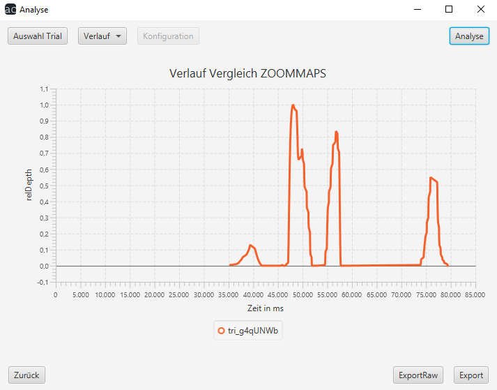

# Analyse Benutzerhandbuch

## Verlauf

Wenn Sie `Verlauf` auswählen, müssen Sie anschließend oben rechts auf dem Bildschirm noch auf den `Analyse-Button` klicken. Daraufhin wird Ihnen die Verlaufsstatistik angezeigt.

Am unteren Bildschirmrand haben Sie die Option zum Menü zurückzukehren oder das Ergebnis zu exportieren.

`ExportRaw` exportiert eine JSON-Datei, `Export` eine PNG-Datei.

[zurück](index.md) | [Home](../../index.md)
