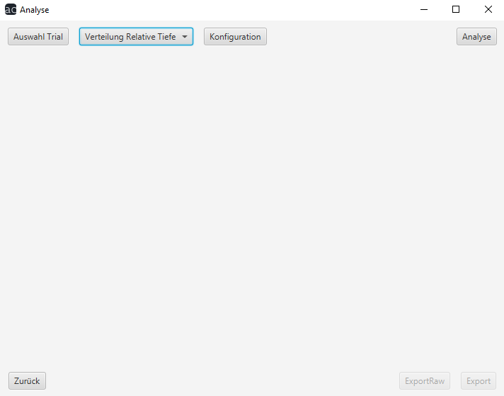
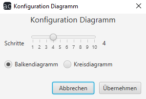
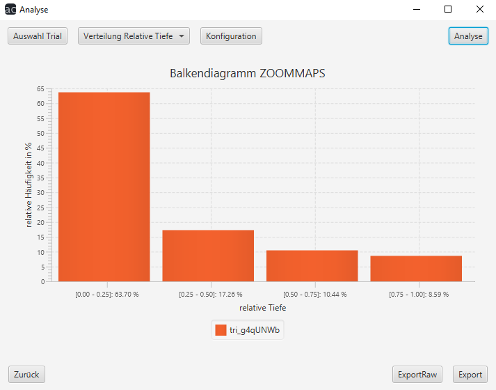

# Analyse Benutzerhandbuch

## Verteilung Relative Tiefe

Haben Sie `Verteilung Relative Tiefe` als Tool-Typ ausgewählt, können Sie Einstellungen zur Ergebnisanzeige unter dem `Konfiguration`-Button ändern.

Haben Sie diesen Button angeklickt, öffnet sich ein kleines Fenster in dem Sie die Einstellungen vornehmen können. Haben Sie die Einstellungen ausgewählt, müssen sie auf den `Übernehmen`-Button klicken. Daraufhin schließt sich das Fenster wieder.
Wählen Sie `Abbrechen` aus, werden die Standard-Einstellungen übernommen. Dies passiert auch, wenn Sie den Konfigurations-Schritt überspringen.

Nachdem Sie Ihre Einstellungen ausgewählt, bzw. wenn Sie die Konfiguration übersprungen haben, müssen Sie noch auf dem oberen rechten Bidschirmrand auf den `Analyse`-Button klicken. Daraufhin wird Ihnen das Ergebnis angezeigt.

Am unteren Bildschirmrand haben Sie die Option zum Menü zurückzukehren oder das Ergebnis zu exportieren.

`ExportRaw` exportiert eine JSON-Datei, `Export` eine PNG-Datei.

[zurück](index.md) | [Home](../../index.md)
