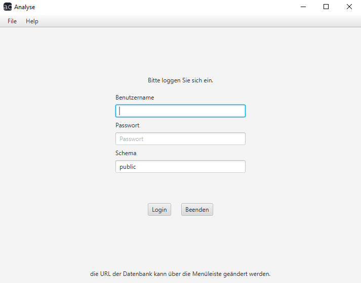

# Analyse Benutzerhandbuch

## Startbildschirm
Sobald das Programm gestartet wird, werden Sie aufgefordert, sich mit Ihren Zugangsdaten anzumelden.

Nachdem Sie diese eingegeben haben, können Sie sich mit dem Login-Button anmelden und kommen somit somit zu den [Analyse-](analysetool/index.md), [Konfigurations-](konfigurator/index.md) und [Trialbuildtools](trials/index.md) des eigentlichen Programms.
Alternativ können Sie mit dem Beenden-Button das Programm beenden.

Am Oberen Bildschirmrand sehen Sie links einen Reiter, mit dem Sie unter [File](menueleiste/file.md) und [Help](menueleiste/help.md) Dropdown-Menüs navigieren können.