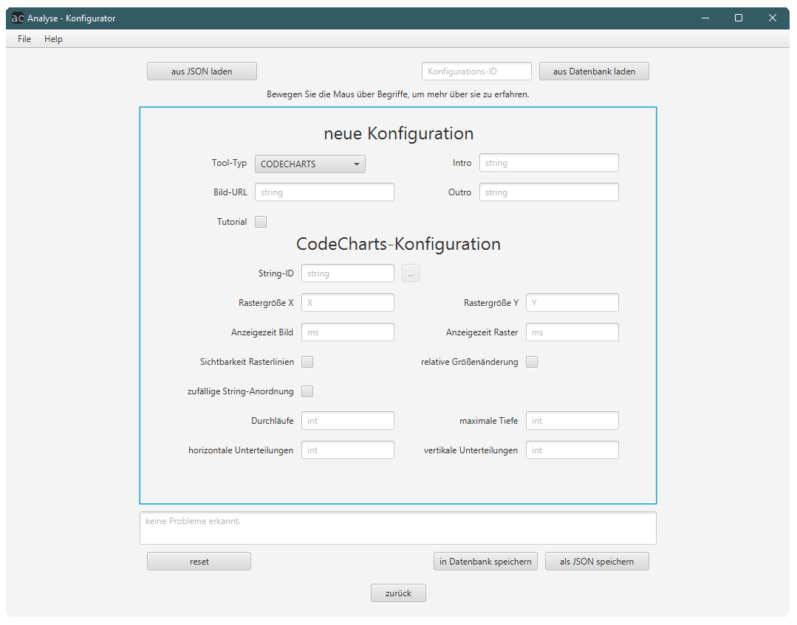
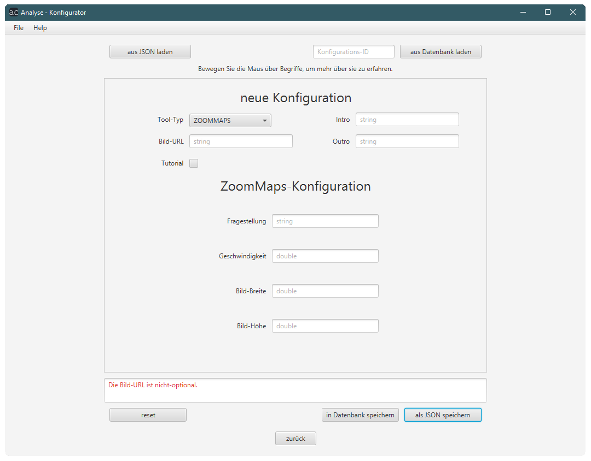

# Konfigurator

genaue Beschreibung der Konfigurationsmöglichkeiten: [Erstellen von Konfigurationen](konfigurationen.md)

Das Konfigurator-Tool erlaubt es Admins:
* Konfigurationen zu erstellen
* Konfiguration in JSON und einer Datenbank abzuspeichern
* Konfiguration aus einer JSON-Datei oder aus einer Datenbank zu lesen
* Konfigurationen zu betrachten

---

Beispiele:
1. Erstellen einer neuen Konfiguration
    * Tool-Typ auswählen und allgemeine Einstellungen Treffen
    * Tool-spezifische Einstellungen treffen
    * Abspeichern in Datenbank mittels Button <kbd>in Datenbank speichern</kbd>
        * die zugehörige ID wird daraufhin angezeigt
    * Abspeichern als JSON-Datei mittels Button <kbd>als JSON speichern</kbd>
2. Betrachten einer bestehenden Konfiguration
    * Konfiguration aus JSON-Datei laden mittels Button <kbd>aus JSON laden</kbd>
     _oder_
    * Konfigurations-ID in Textfeld eingeben und mittels Button <kbd>aus Datenbank laden</kbd> aus der Datenbank laden
    * Die geladene Konfiguration wird in der GUI angezeigt.
3. Bearbeiten einer bestehenden Konfiguration
    * Schritte von `2.` durchführen
    * Konfiguration kann bearbeitet und neu abgespeichert werden. Dabei wird die bestehende JSON-Datei / der Datenbankeintrag nicht verändert, sondern beim Abspeichern wird eine neue Datei erstellt / ein neuer Datenbankeintrag veranlasst.

## Oberfläche zum Erstellen von CodeCharts-Konfigurationen

## Oberfläche zum Erstellen von ZoomMaps-Konfigurationen

* Der Button <kbd>reset</kbd> setzt die eingetragenen Werte zurück.
* Im untersten Textfeld werden Probleme beim Speichern / Laden angezeigt.
