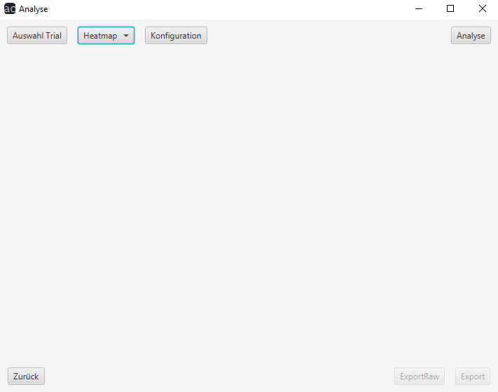
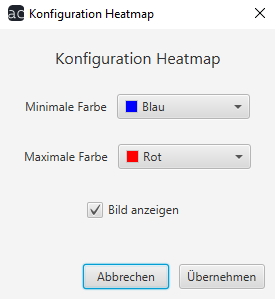
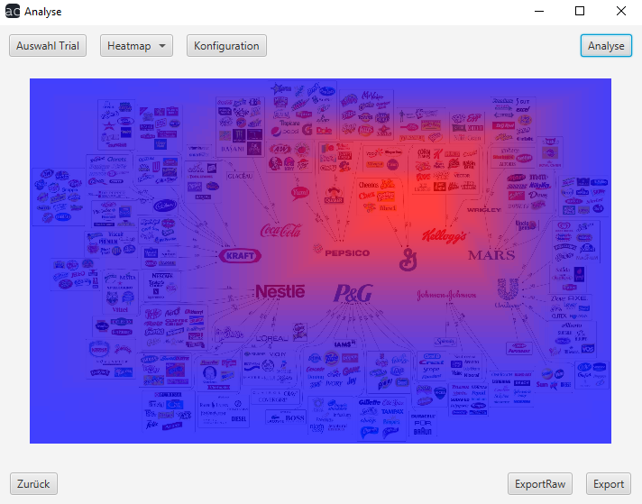

# Analyse Benutzerhandbuch

## Heatmap

Nachdem Sie bei Tool-Typ Heatmap ausgewählt haben, können Sie noch auf den "Konfigurationen"-Button klicken. 

Daraufhin tut sich ein Fenster auf, in dem Sie die Farben der Heatmap verändern können und auswählen können, ob das Versuchsbild angezeigt werden soll.

Daraufhin können Sie sich auf dem "Analyse"-Button das Ergebnis anzeigen lassen. Wenn die Konfigurations-Einstellungen für Sie uninteressant sind, können Sie diesen Schritt auch überspringen und es werden die Standardeinstellungen übernommen.

Am unteren Bildschirmrand haben Sie die Option zum Menü zurückzukehren oder das Ergebnis zu exportieren.

"ExportRaw" exportiert eine JSON-Datei, "Export" eine PNG-Datei.

[zurück](index.md) | [Home](../../index.md)