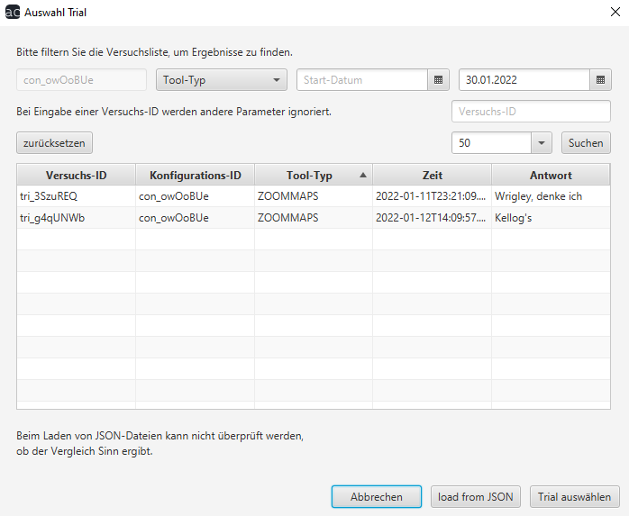

# Analyse Benutzerhandbuch

## Verlauf Vergleich

Verlauf Vergleich ist ähnlich zu [Verlauf](verlauf.md). Hier haben Sie allerdings die Möglichkeit, Versuche miteinander zu vergleichen.

Zusätzlich zu Verlauf haben Sie hier am oberen Bildschirmrand nun die Möglichkeit auf dem "Auswahl Vergleichs-Trial"-Button einen Versuch zum Vergleichen auszuwählen.

Wählen Sie hier den Versuch aus, mit welchem Sie den ersten vergleichen wollen und klicken Sie daraufhin auf "Trial auswählen". Nun müssen Sie noch oben rechts auf den "Analyse"-Button klicken um die Ergebnisse zu sehen.

Am unteren Bildschirmrand haben Sie die Option zum Menü zurückzukehren oder das Ergebnis zu exportieren.

"ExportRaw" exportiert eine JSON-Datei, "Export" eine PNG-Datei.

[zurück](index.md) | [Home](../../index.md)