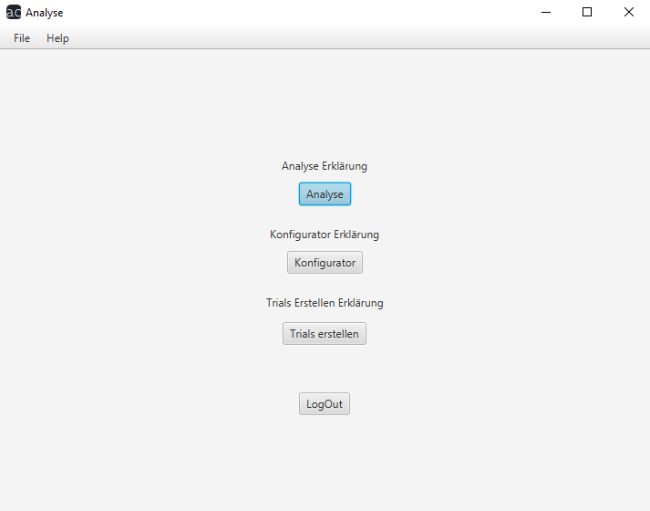

# Analyse Benutzerhandbuch

## Menü

Wie auch auf dem [LogIn-Fenster](../index.md) sehen Sie hier auf dem oberen Bildschirmrand [File](../file.md) und [Help](../help.md), unter welchen Sie Dropdown-Menüs auswählen können.

Des Weiteren finden Sie auf dem Bildschirm vier weitere Optionen vor:
- ###### [Analyse](analyse/index.md)
- ###### [Konfigurator](konfigurator/index.md)
- ###### [Trials Erstellen](trials/index.md)
- ###### LogOut
  Hiermit können Sie sich von dem Programm abmelden

[Home](../index.md)