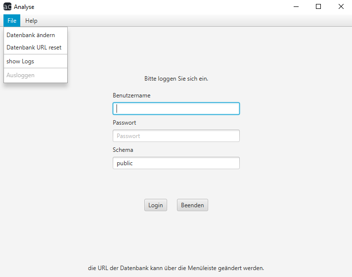
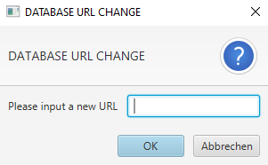
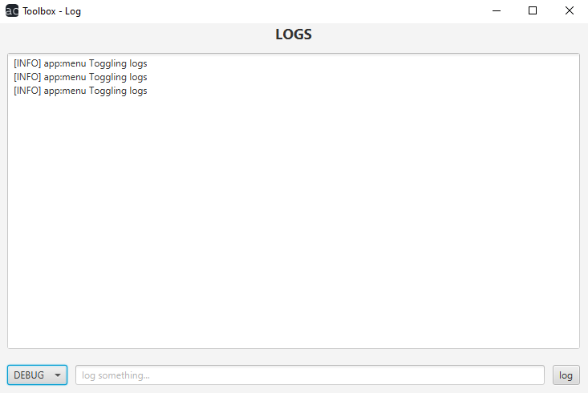

# Analyse Benutzerhandbuch

## File

Wenn Sie auf `File` klicken, öffnet sich ein Dropdown-Menü unter welchem Sie zwischen vier verschiedenen Optionen wählen können.

- `Datenbank ändern` 
  Falls Sie nicht die Standard-Datenbank des Programms nutzen möchten, können Sie hier das Programm mit Ihrer eigenen verbinden.
   
  
- `Datenbank URL reset` 
  Hiermit können Sie wieder eine Verbindung mit der Standard-Datenbank aufbauen 
- `show Logs` 
  Hier können Sie die Log-Einträge des Programms anschauen
  
- `Ausloggen` 
  Mit dieser Option können Sie sich (nach dem Anmelden) aus dem Programm ausloggen

[Home](index.md)
