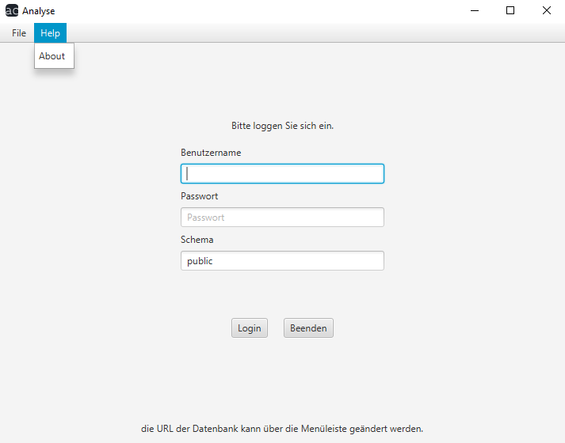

# Analyse Benutzerhandbuch

## Help

Drücken Sie auf `Help`, erscheint in dem Dropdown-Menü die Option `About`. Wählen Sie diese aus, werden Sie per Standard-Browser auf die Github-Dokumentation unseres Programms weitergeleitet.

[Home](index.md)
