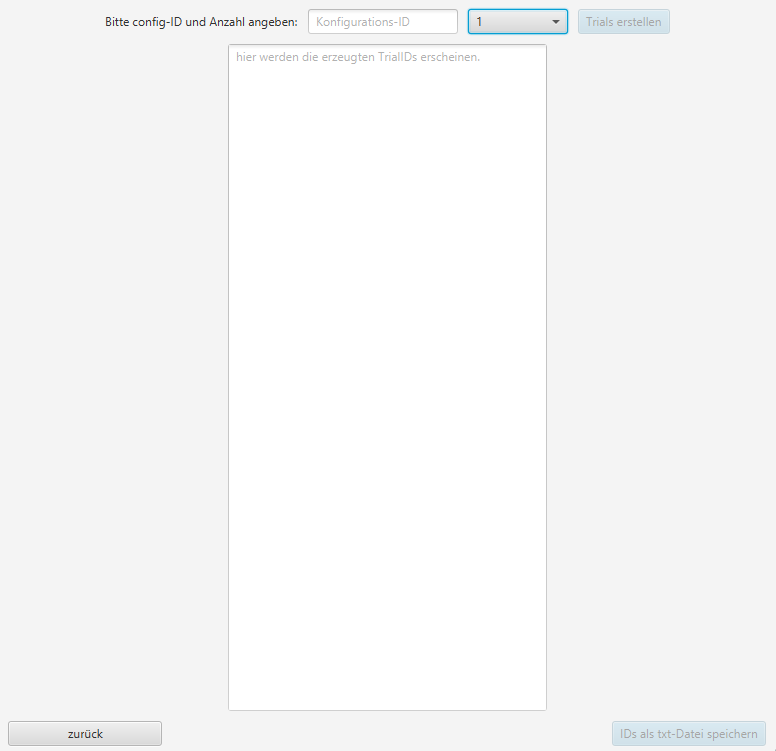

In dieser Ansicht können Trial-IDs erstellt werden, die zu einer Konfigurations-ID gehören. Die erstellten Trial-IDs werden in der Datenbank abgespeichert und in der App ausgegeben.

Vorgehensweise:
* Konfigurations-ID aus der Datenbank eingeben
* Anzahl auswählen
* Button `Trials erstellen` betätigen
* Trial-IDs aus Textfeld kopieren oder als txt-Datei speichern

Je nach gewählter Anzahl kann der Prozess etwas Zeit in Anspruch nehmen.
