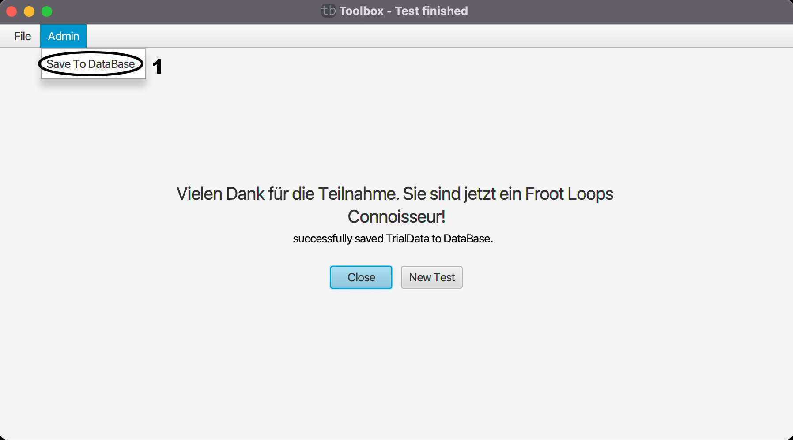

# End-Admin

Dieses Menü ist mit [File](end-file.md) hauptsächlich für administrative Arbeiten gedacht und wird auch nur angezeigt, wenn man als Admin mit der Datenbank verbunden ist.

(1) Speichert das Ergebnis des Tests in der Datenbank. Wenn man als Admin eingeloggt ist, geschieht dies nicht automatisch.

[zurück](toolbox.md)