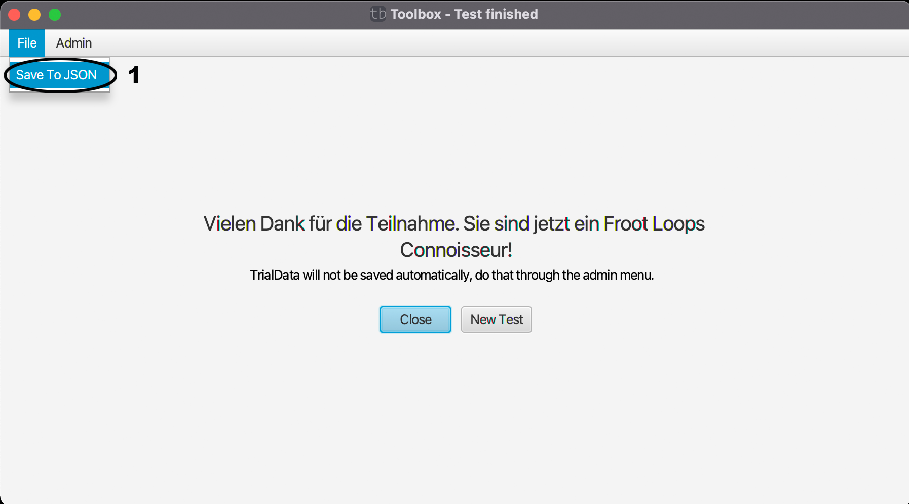

# File Menü (Endbildschirm)

Dieses Menü kann praktisch sein, um die erhobenen Daten ohne Datenbank zu speichern.

Save To JSON(1) ermöglicht es den abgeschlossenen Test zusätzlich als JSON lokal abzuspeichern.

| [zurück](index.md) | [Home](../index.md) |
