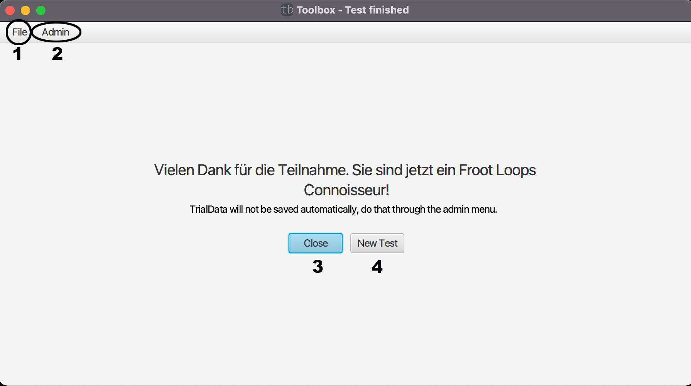

# Test abgeschlossen

Nachdem der Test abgeschlossen ist gelangt man zum Endbildschirm. Auch hier ist die Nachricht wieder in der Config einstellbar.

Über den Button Close(3) kann das Programm beendet werden und über newTest(4) gelangt man wieder zum [Startbildschirm](../codecharts.md).

Genaure Infos zu (1)[File](file.md) und (2)[Admin](admin.md) finden sie auf den verlinkten Seiten.

[zurück](../index.md)
