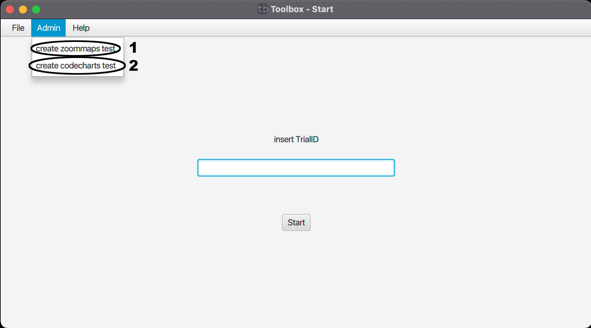

# Home-Admin

Dieses Menü ist mit (File) hauptsächlich für administrative Arbeiten gedacht und wird auch nur angezeigt, wenn man als Admin mit der Datenbank verbunden ist.

(1) erstellt einen automatisch generierten ZoomMaps-Test um mögliche Probleme schnell zu debuggen. (Änderung der Config, kann im Code bearbeitet werden).

(2) erstellt einen automatisch generierten CodeCharts-Test um mögliche Probleme schnell zu debuggen. (Änderung der Config, kann im Code bearbeitet werden).

[zurück](toolbox.md)