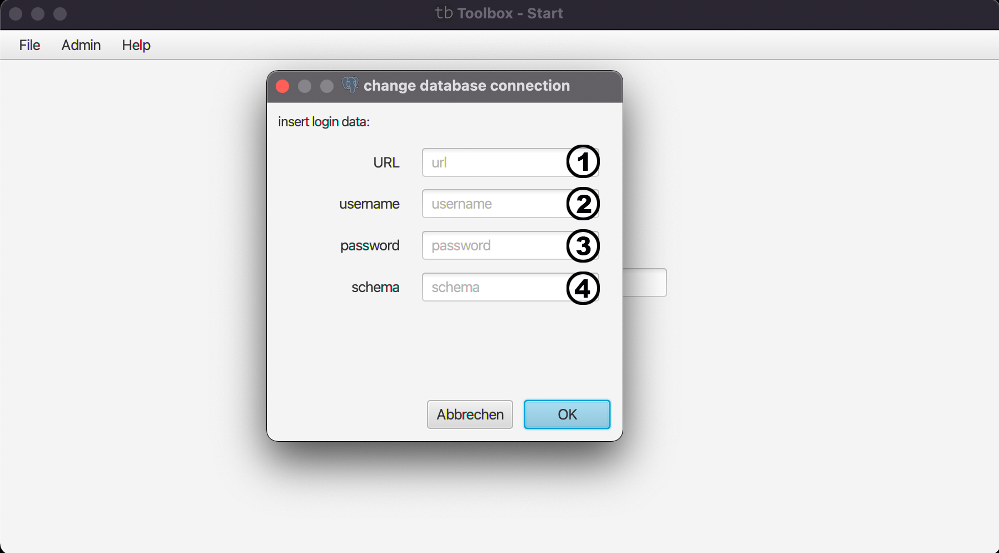

# Change Database Conncetion

Mit diesem Menü können Sie die Verbindung zu einer anderen Datenbank direkt in der GUI ermöglichen. Allerdings ist dies nur für die Zeit während das Programm läuft, nach einem Neustart wird wieder die ursprüngliche Datenbank verwendet.

(1) Hier geben sie die Adresse ihrer Datenbank ein.

(2) + (3) Hier geben sie den Nutzernamen + Passwort die Sie für den Zugang ihrer Datenbank brauchen ein.

(4) Hier wird das Schema ihrer Datenbank eingetragen.

| [zurück](home-file.md) | [Home](toolbox.md) |