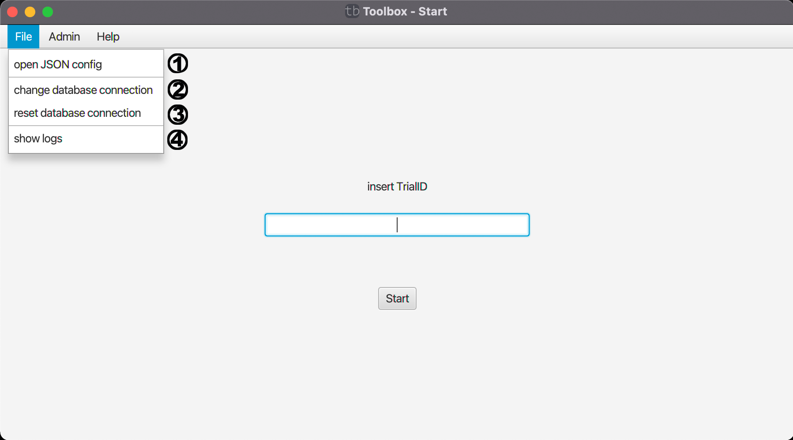

# Home-File

Dieses Menü ist mit [Admin](home-admin.md) hauptsächlich für administrative Arbeiten gedacht und wird auch nur angezeigt, wenn man als Admin mit der Datenbank verbunden ist.

(1) Man kann den Test mit einer selbst erstellten JSON config laden.

[(2) Ermöglicht die Änderung der Datenbank.](home-change-database.md)

(3) Setzt die Datenbank zur ursprünglich festgelegten Datenbankverbindung zurück.

[(4) Zeigt ein Log-Fenster zum debuggen.](home-log.md)

| [zurück](start-window.md) | [Home](toolbox.md) |