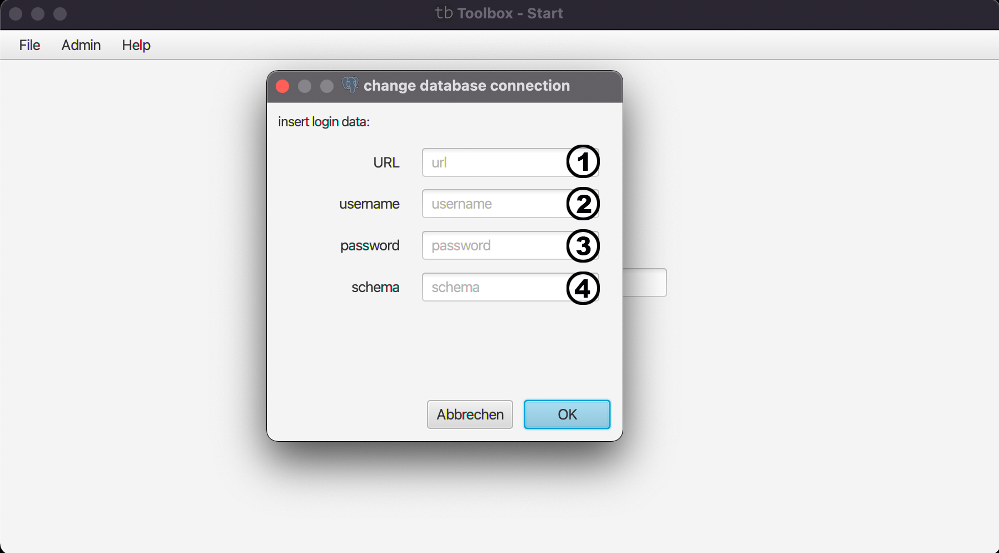

# Change Database Connection

Mit diesem Menü können Sie die Datenbakverbidnung innerhalb der GUI abändern. Nach Neustart der App wird wieder die voreingestellt Datenbank verwendet.
Soll also die Datenbank immer eine andere sein, ist es zu empfehlen die App selbst zu kompilieren.

(1) Hier geben Sie die Adresse der Datenbank ein.

(2) + (3) Hier geben Sie die Anmeldedaten ein.

(4) Hier wird das Schema der Datenbank eingetragen.

| [zurück](index.md) | [Home](../../index.md) |
