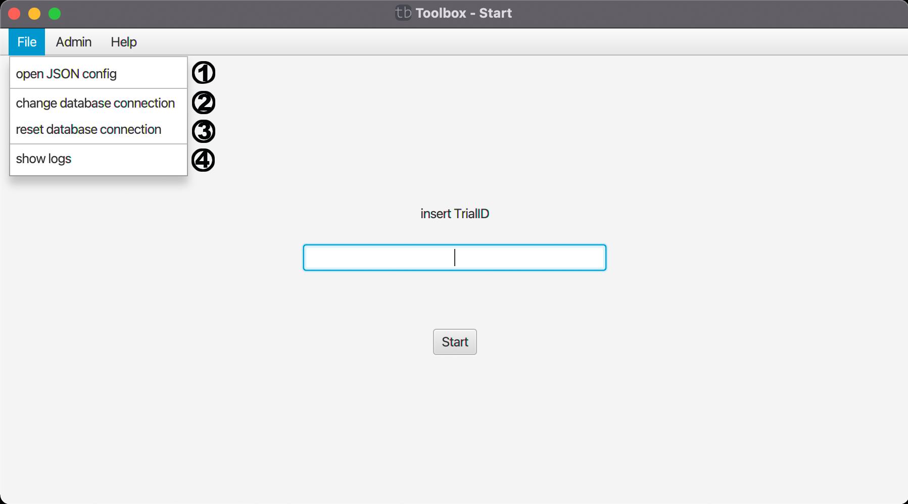

# File

Dieses Menü kann praktisch zum Entwickeln von Tests / zum Debuggen von fehlerhaften Tests sein.

(1) Man kann den Test mit einer selbst erstellten JSON Konfiguration laden.

[(2) Ermöglicht die Änderung der Datenbank.](change-database.md)

(3) Setzt die Datenbank zur ursprünglich festgelegten Datenbankverbindung zurück.

[(4) Zeigt ein Log-Fenster zum debuggen.](log.md)

| [zurück](../index.md) | [Home](../../index.md) |
