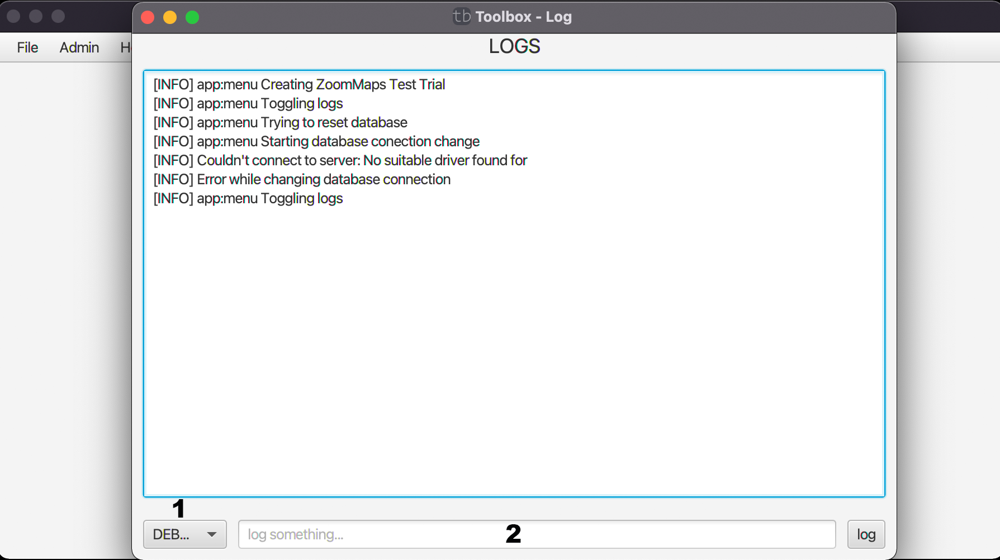

# Shows the Log

In diesem Fenster erhalten sie Informationen über geloggte Fehler.

Unter dem Log Fenster können sie selber einen Eintrag in den Log machen. In (1) wählen sie den Fehler/das Problem aus und in (2) schreiben sie die Nachricht rein.

| [zurück](index.md) | [Home](../../toolbox.md) |
