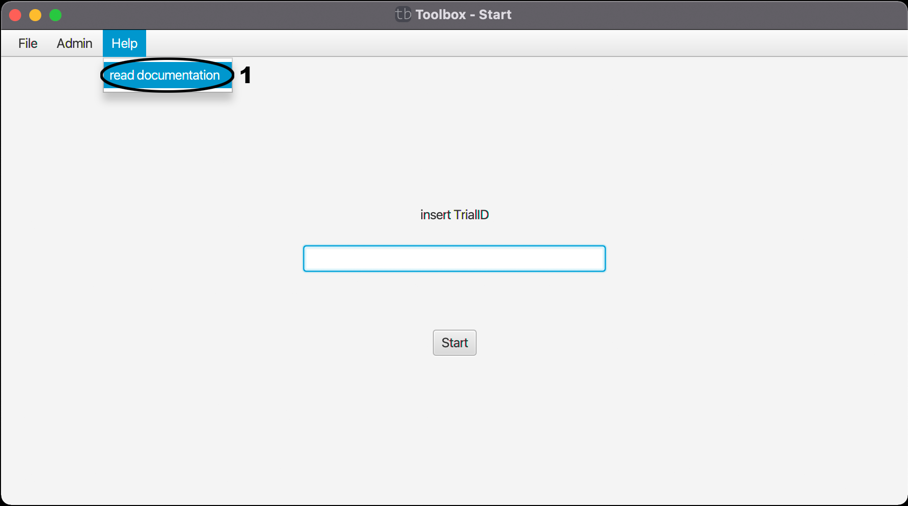

# Home-Help

In dem Reiter Help besteht die Möglichkeit eine genauere Dokumentation des Programms im Github nachzulesen. Dazu muss man nur auf (1) drücken und die Dokumentation wird in ihrem Standard-Browser geöffnet.

| [zurück](index.md) | [Home](../toolbox.md) |
