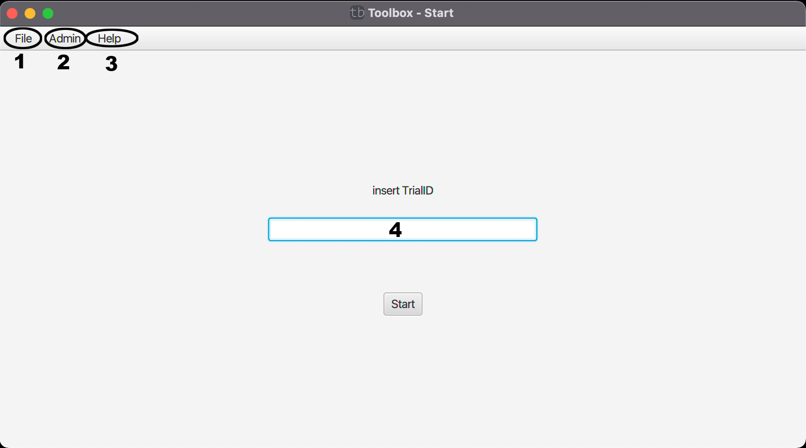

# Startbildschirm

Der Nutzer gibt seine zugesendete TrialID in (4) ein und kann somit den Test starten.

Genauere Infos zu (1)[File](file/index.md), (2)[Admin](admin.md) und (3)[Help](help.md) finden Sie auf den verlinkten Seiten.

[zurück](../index.md)
