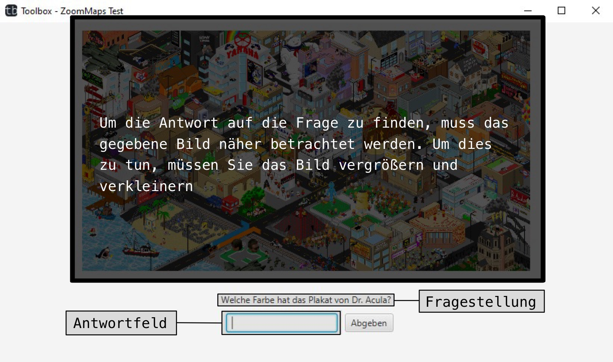

# Der ZoomMaps Versuch
[zurück](toolbox.md)
## Tutorial
Bevor der Test startet wird das Tutorial angezeigt. Während des Tutorials kann man über vor und zurück Button, beliebig durch das Tutorial gehen. Es besteht jederzeit das Tutorial direkt abzuschließen und mit dem Test zu beginnen.

### Schritt 1

### Schritt 2

### Schritt 3

### Schritt 4

### Schritt 5

## Tutorial abgeschlossen
Nachdem man das Tutorial abgeschlossen hat, kommt noch eine Nachricht, welche Einstellbar ist, die einem z.B. Erfolg beim Test wünscht.

Nach diesem Fenster beginnt dann der eigentliche Test, wie in dem Tutorial gezeigt.

[zurück](toolbox.md)
